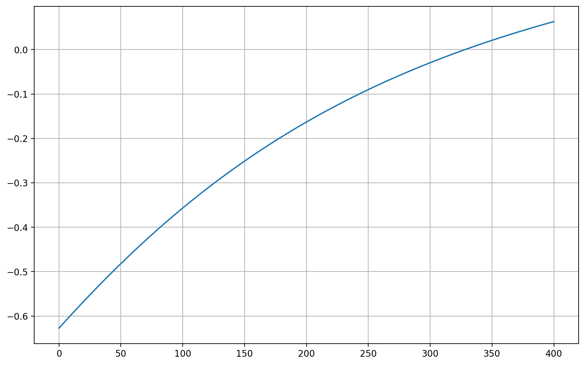

<h1> Raízes de Equações</h1>


$$ L\dfrac{di}{dt} + Ri + \dfrac{q}{C}=0 $$

$$ q(t)= q_{0}e^{\dfrac{-Rt}{2L}}\cos\left[\sqrt{\dfrac{1}{LC}-{\left(\dfrac{R}{2L}\right)}^{2}}t\right] $$

<p>Determinar a resistência para dissipar a energia a uma taxa de 1% de seu valor inicial $(q/q_{0}=0,01)$ em $t=0,05s$ com $L=5H$ e $C=10^{-4}F$.</p>

$$ f(R)=e^{\dfrac{-Rt}{2L}}\cos\left[\sqrt{\dfrac{1}{LC}-{\left(\dfrac{R}{2L}\right)}^{2}}t\right]-\dfrac{q}{q_0}$$


```python
import sympy as sy
from sympy.abc import R,L,C,t
f=sy.exp((-R*t)/(2*L))*sy.cos(sy.sqrt((1/(L*C))-(R/(2*L))**2)*t)-0.01;f
```


$\displaystyle -0.01 + e^{- \frac{R t}{2 L}} \cos{\left(t \sqrt{- \frac{R^{2}}{4 L^{2}} + \frac{1}{C L}} \right)}$


```python
R,L,C,t=sy.symbols('R L C t')
f_r=(f.subs(L,5))
f_r=f_r.subs(C,0.0001)
f_r=f_r.subs(t,0.05);f_r
```


$\displaystyle -0.01 + e^{- 0.005 R} \cos{\left(2.23606797749979 \sqrt{1 - 5.0 \cdot 10^{-6} R^{2}} \right)}$


```python
f=sy.lambdify(R,f_r,"numpy")
```


```python
import numpy as np
import timeit as tm
import matplotlib.pyplot as plt
r=np.linspace(0,400)
fig = plt.figure(figsize=(11,7),dpi=200)
plt.plot(r,f(r))
plt.grid()
plt.show()
```





<h1> Método da Bissecção</h1>


```python
a=0
b=400
epsilon=1e-4
def bissec(a,b,f,epsilon):
    i=0
    while(1):
        x= (a+b) / 2 

        if f(a) * f(x) < 0:
            b = x
        else:
            a = x
        
        if  ((abs(b-a)) < epsilon) or (abs(f(x)) < epsilon):
                break
        i=i+1
    return x,i
inicio = tm.default_timer()
x,i=bissec(a,b,f,epsilon)
fim =  tm.default_timer()
print('Solução: {0:f} \nTempo: {1:f} \nIterações: {2:d}'.format(x,(fim-inicio),i))
```

    Solução: 328.125000 
    Tempo: 0.000237 
    Iterações: 6


<h1> Método da Falsa Posição</h1>


```python
def false_pos(a,b,f,epsilon):
    i=0
    while(1): 
        x=(a*f(b)-b*f(a)) /(f(b)-f(a)) 

        if f(a) * f(x) < 0:
            b = x
        else:
            a = x
        if  ((abs(b-a)) < epsilon) or (abs(f(x)) < epsilon): 
            break
        i+=1   
    return x,i
inicio = tm.default_timer()
x,i=false_pos(a,b,f,epsilon)
fim =  tm.default_timer()
print('Solução: {0:f} \nTempo: {1:f} \nIterações: {2:d}'.format(x,(fim-inicio),i))
```

    Solução: 328.199698 
    Tempo: 0.003085 
    Iterações: 9


<h1> Método de Newton</h1>


```python
def derivate (f,symbol):
    x=sy.Symbol(symbol)
    f_l = f.diff(x)
    fi = x - (f/f_l)
    fi = sy.lambdify(x,fi,"numpy") 
    return fi
```


```python
def newton(x,f_s,f,symbol,epsilon):
    fi=derivate(f_s,symbol)
    i=0
    while (1):
        fx=f(x)
        aux=fi(x)
        if epsilon > abs(fx) or abs(aux-x)<epsilon:
            break
        x=aux
        i+=1
    return x,i
inicio = tm.default_timer()
x,i=newton(1.5,f_r,f,'R',epsilon)
fim =  tm.default_timer()
print('Solução: {0:f} \nTempo: {1:f} \nIterações: {2:d}'.format(x,(fim-inicio),i))
```

    Solução: 328.149271 
    Tempo: 0.016318 
    Iterações: 4


<h1> Método das Secantes</h1>


```python
def secant(a,b,f,epsilon):
    i=0
    while(1):
        x=( b * f(a)-(a)*f(b))/(f(a)-f(b))
        if epsilon > abs(f(x)): # criterio  de parad
            break
        a=b
        b=x
        i+=1
    return x,i
inicio = tm.default_timer()
x,i=secant(a,b,f,epsilon)
fim =  tm.default_timer()
print('Solução: {0:f} \nTempo: {1:f} \nIterações: {2:d}'.format(x,(fim-inicio),i))
```

    Solução: 328.154047 
    Tempo: 0.000281 
    Iterações: 3

